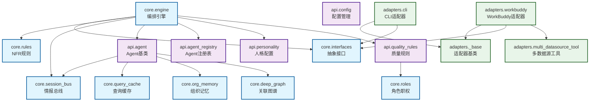

# wallstreet-tieling v1.0 架构

## 三层架构

```
用户一句话 "ABC公司" / "查一下张三"
          │
          ▼
┌─────────────────────────────────┐
│ core/engine.py    纯编排引擎      │  ← 零平台依赖, 零 API key, 零 MCP 引用
│ ┌─────────┐ ┌─────────────────┐ │
│ │13 Agent │ │ 3-Phase 真并发  │ │
│ │人格+职权│ │ + 条件分支      │ │
│ ├─────────┤ ├─────────────────┤ │
│ │SessionBus│ │ Quality L1+L2  │ │
│ │情报总线  │ │ 政委门禁       │ │
│ ├─────────┤ ├─────────────────┤ │
│ │Phase 1.5│ │ QueryCache     │ │
│ │团队会议  │ │ + OrgMemory    │ │
│ └─────────┘ └─────────────────┘ │
│         ↓ PlatformAdapter ↓       │
└─────────────────────────────────┘
          │
          ▼
┌─────────────────────────────────┐
│ adapters/     平台适配器         │  ← 每个平台一个文件
│ ┌──────┐ ┌──────┐ ┌──────────┐ │
│ │  WB  │ │ CLI  │ │Dify/Coze │ │
│ │MCP+  │ │HTTP  │ │(模板)    │ │
│ │Skill │ │API   │ │          │ │
│ └──────┘ └──────┘ └──────────┘ │
└─────────────────────────────────┘
```

## 核心模块

| 文件 | 职责 |
|------|------|
| `core/interfaces.py` | LLMProvider / ToolProvider / OutputProvider 抽象 |
| `core/engine.py` | 编排引擎 — 3-Phase + 会议 + Bus |
| `core/rules.py` | NFR 规则 + Phase 模板 + 条件分支 |
| `core/roles.py` | 13 角色职权 (4 层: L0/L1/L2/L3) |
| `core/session_bus.py` | 结构化情报传递 (Facts/Signals/Contradictions) |
| `core/deep_graph.py` | 多跳关联图 ≤8跳, 环检测 |
| `core/query_cache.py` | 会话内/跨会话缓存 |
| `core/org_memory.py` | 五层本地组织记忆 |

## 13 角色职权

| 层 | 角色 | 域 |
|:--:|------|------|
| L0 | 钱守正 | 全局统筹, 最终签核 |
| L1 | 张铁柱 李明远 王思远 赵刚 马力全 周通 | 工商/财务/行业/风险/人员/技术 |
| L2 | 郑慎之 吴德厚 | 数据验证 / 质量门禁 |
| L3 | 刘文华 颜好看 | 报告撰写 / 排版设计 |
| LX | 陈志远 暗哨 | 任务拆解 / 全流程监控 |

## 信息流

```
P1: 5角色并行调查 → SessionBus 提取
P1.5: 团队会议 (矛盾>0 触发) → Bus 更新决议
P2: 2角色并行验证 → Bus 标记 verified
P3: 2角色并行输出 → 最终报告
```

## 适配器模式

```python
# WorkBuddy
adapter = PlatformAdapter(WorkBuddyLLM(), WorkBuddyTools(), WorkBuddyOutput())

# CLI
adapter = PlatformAdapter(StandaloneLLM(), NoopTools(), StandaloneOutput())

# Dify (用户贡献)
adapter = PlatformAdapter(DifyLLM(), DifyTools(), DifyOutput())

engine = Engine(target="ABC公司", adapter=adapter)
result = await engine.run()
```

## 模块依赖图

> 修改影响范围参考 — 修改被依赖模块时需注意影响范围



### 依赖说明

| 模块 | 依赖 | 说明 |
|------|------|------|
| `core.engine` | `core.interfaces`, `core.rules`, `core.session_bus`, `api.agent`, `api.agent_registry`, `api.personality`, `api.quality_rules` | 编排引擎依赖所有核心模块 |
| `api.agent` | `core.session_bus`, `core.query_cache`, `core.org_memory`, `core.deep_graph` | Agent 依赖会话总线、缓存、记忆、图谱 |
| `adapters.workbuddy` | `adapters._base`, `core.interfaces`, `adapters.multi_datasource_tool` | WorkBuddy 适配器依赖基类、接口、多数据源工具 |
| `api.quality_rules` | `core.roles` | 质量规则依赖角色职权定义 |

### 修改影响范围

| 被依赖模块 | 影响范围 | 修改风险 |
|------------|---------|---------|
| `core.interfaces` | 所有 adapters + engine | 🔴 高 |
| `core.session_bus` | engine + 所有 Agent | 🔴 高 |
| `api.agent` | engine | 🟠 中 |
| `core.rules` | engine | 🟡 低 |
| `api.personality` | engine | 🟡 低 |

## 测试

```bash
pytest tests/unit/ -q  # 402 passed
```

## 贡献适配器

1. 在 `adapters/` 创建 `{platform}.py`
2. 实现 LLMProvider / ToolProvider / OutputProvider
3. 在 `prompts/{platform}/` 创建提示词模板
4. 提交 PR
