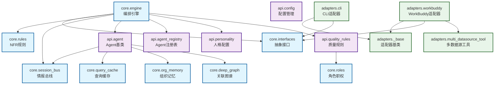

## 模块依赖图

### 依赖说明

| 模块 | 依赖 | 说明 |
|------|------|------|
| `core.engine` | `core.interfaces`, `core.rules`, `core.session_bus`, `api.agent`, `api.agent_registry`, `api.personality`, `api.quality_rules` | 编排引擎依赖所有核心模块 |
| `api.agent` | `core.session_bus`, `core.query_cache`, `core.org_memory`, `core.deep_graph` | Agent 依赖会话总线、缓存、记忆、图谱 |
| `adapters.workbuddy` | `adapters._base`, `core.interfaces`, `adapters.multi_datasource_tool` | WorkBuddy 适配器依赖基类、接口、多数据源工具 |
| `api.quality_rules` | `core.roles` | 质量规则依赖角色职权定义 |

### 修改影响范围

| 被依赖模块 | 影响范围 | 修改风险 |
|------------|---------|---------|
| `core.interfaces` | 所有 adapters + engine | 🔴 高 |
| `core.session_bus` | engine + 所有 Agent | 🔴 高 |
| `api.agent` | engine | 🟠 中 |
| `core.rules` | engine | 🟡 低 |
| `api.personality` | engine | 🟡 低 |
