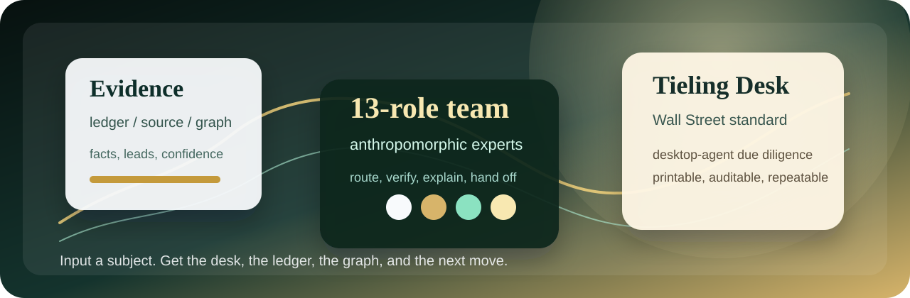

# Wallstreet Tieling

> 华尔街驻铁岭办事处：铁岭的外壳，华尔街的尽调标准。你给一个主体名，我们把来源、关系、风险、底稿和下一步动作一起端上桌。



[](#current-release)
[](#desktop-agent-surfaces)
[](deploy/mcp-server.json)
[](LICENSE)

**中文** | [English](#english-overview)

Wallstreet Tieling is an evidence-first enterprise intelligence, due-diligence,
and risk-discovery toolkit for desktop agents, local operators, and
MCP-compatible workflows.

It turns a company name into a provenance-preserving investigation packet:
source routing, evidence ledger, relationship graph, capital-risk panel, report
exports, and a 13-role anthropomorphic expert-team handoff surface.

## 中文简介

Wallstreet Tieling / 华尔街驻铁岭办事处，是给专业用户和桌面 Agent 用的
深度商业尽调运行时。它不是“搜一下公司简介”，也不是把网页摘要拼成报告；
它要做的是把来源、证据、关系、风险、置信度和下一步核验动作，一次性摊到桌面上。

一句话：**别装，别糊，别把“像是”写成“就是”。**

如果别的工具是在“查个底”，Wallstreet Tieling 想做的是“把底稿铺开”。
不端着，不玄学，不拿一段像结论的话糊弄人。能查到的，就把证据挂上去；
没查实的，就老老实实打成线索；还要继续追的，直接给下一步动作和接力位。

输入一个主体名称后，系统会交付一份可继续推进的调查包：

- 有来源、有置信度、有核验状态的证据链。
- 主体画像、关系图谱、资本风险、风险事件和后续核验队列。
- Markdown、JSON、便携 HTML、DOCX 元数据、目录包和 `agent-handoff.json`。
- Codex、Claude Code、Hermes、豆包办公任务模式、OpenClaude 类开源 Agent、
  WorkBuddy expert-team surface 和通用 MCP/CLI/API 的交付面。

品牌定位很简单：**东北式不装，华尔街式留痕；铁岭牌子挂门口，证据链要硬到底。**

你也可以把它理解成一间开在本地的尽调办公室：门口是铁岭牌子，里面按华尔街标准归档。
案子扔进来，出来的不该是一段漂亮废话，而是一份能打印、能复核、能交给下一个 Agent
继续往下查的调查包。

## 核心竞争力：拟人化专家团

拟人化是这个项目最重要的产品差异，不是装饰层。Wallstreet Tieling 不想把
Agent 做成一个只会输出总结的搜索框，而是把它做成一间会分工、会接力、会留底稿的
尽调办公室：有人盯来源，有人拆股权，有人看资本，有人查异常，有人负责把证据讲明白。

普通工具给你一段“看起来像结论”的话；这里给你一套能继续干活的班子、底稿和路线图。
13 个专家角色不是为了热闹，而是为了让复杂调查不塌成一团聊天记录。

- **像团队**：角色有分工、有口径、有接力边界。
- **像底稿**：事实、线索、推断、风险提示分层保留。
- **像产品**：CLI、API、MCP、插件、报告和交接包都走同一套证据结构。

一句话：不是让 AI 装成人，而是让 AI 按专业团队的方式干活。

## 网感版理解

这不是“AI 帮我总结一下”，这是“把案子摆到桌上，让一队人按证据链往下查”。

普通查询工具爱给你一个像样的答案，Wallstreet Tieling 更在意给你一套能继续干活的底稿。
看起来像结论，不算结论；挂不上来源，不算结果；经不起追问，就不能往报告里写死。

我们想交付的不是一个会聊天的壳，而是一套能落地的调查生产线：
有人盯来源，有人拆关系，有人看资本，有人挑异常，有人负责把证据讲明白。
拟人化不是装饰，而是把复杂调查拆成可协作、可复核、可接力的产品结构。

## English Overview

Wallstreet Tieling is an open-source due-diligence runtime for agentic
workflows. It helps desktop agents and local operators collect public or
user-authorized signals, separate facts from leads, preserve evidence, and
deliver machine-readable investigation artifacts instead of prose-only answers.

It is designed for professional workflows where the output must be inspectable,
repeatable, and handoff-ready.

## Why It Exists

Most investigation tools stop at a readable summary. Wallstreet Tieling focuses
on the harder operational layer:

- **Evidence over vibes**: claims are tied to source, confidence, and follow-up
  status.
- **Agent-native delivery**: CLI, REST, MCP, Codex plugin, skill prompt, and
  host adapters expose the same runtime contract.
- **Deep handoff, not chat collapse**: report exports preserve graphs,
  verifier recipes, source-health state, and agent-autorun fields.
- **Professional defaults**: safe public-mode behavior first; advanced or
  credentialed sources stay explicit and auditable.
- **Personality without sloppiness**: 13 anthropomorphic expert roles route work
  like a due-diligence desk while preserving machine-readable fields.

## Current Release

Status: `0.5.0 Alpha` desktop-agent release candidate.

This release is ready for local desktop-agent packaging and public GitHub
review. It is not a claim of marketplace approval, hosted SaaS readiness,
mini-program/app delivery, or guaranteed live access to every advertised source.

Latest local evidence:

- `npm run acceptance`: `799 passed, 9 skipped` on `2026-07-06 08:24 Asia/Shanghai`
- `npm run api:smoke`: passed
- `npm run codex:mcp-smoke`: passed
- `npm run agent:host-smoke`: passed for all seven alpha desktop-agent variants
- `npm run release:preflight`: `ready_for_local_packaging`
- `npm run delivery:audit`: `pass`
- `npm run objective:audit`: `complete`
- `npm run release:privacy-scan`: `issue_count=0`
- `npm pack --dry-run --json`: passed

## Quick Start

```bash
npx wallstreet-tieling --help
npx wallstreet-tieling --release
npx wallstreet-tieling --connectors
npx wallstreet-tieling --agent-tools
npx wallstreet-tieling --investigate "Apple Inc." --report-only
npx wallstreet-tieling --investigate "Demo Technology Co., Ltd." --offline-fixture --report-only
```

Python entrypoints are also available:

```bash
python bin/investigate.py "Apple Inc." --report-only
python bin/risk_discovery.py "Apple Inc." --summary
python bin/investigate.py "Demo Technology Co., Ltd." --offline-fixture --report-only
```

Run the local API:

```bash
npm run api
```

Useful endpoints:

- `GET /api/health`
- `GET /api/release`
- `GET /api/release-preflight`
- `GET /api/delivery-audit`
- `GET /api/objective-audit`
- `GET /api/connectors`
- `GET /api/agent-tools`
- `POST /api/investigate`

## Desktop-Agent Surfaces

The alpha contract covers seven host variants:

- Universal CLI/API/MCP host
- Codex plugin and MCP host
- Claude Code repository workflow
- Hermes-style local agent workflow
- Doubao Office Task Mode
- OpenClaude / open-source agent hosts
- WorkBuddy expert-team branch

Machine-readable adapter metadata:

```bash
npx wallstreet-tieling --agent-tools
npx wallstreet-tieling --delivery-audit
npx wallstreet-tieling --objective-audit
```

Baseline host sequence:

```text
release_readiness -> delivery_audit -> connector_catalog -> development_requirements -> agent_tool_adapters -> investigate_company
```

## Capability Matrix

| Area | What is included | Runtime evidence |
| --- | --- | --- |
| Investigation packet | Evidence ledger, quality gate, report Markdown, JSON, portable HTML, bundle metadata | `core/investigation.py` |
| Source resilience | Source-health digest, recovery queue, autorun handoff fields | `core/connector_registry.py` |
| Public-origin mapping | QYYJT/commercial concepts mapped to public-origin work orders | `docs/SEARCH_INTEGRATION_LEDGER.md` |
| Relationship graph | Auditable nodes, edges, verification queues, relationship resolution | `core/relationship_resolution.py` |
| Capital risk | Capital exposure and verification queues preserved in reports | `core/risk_graph_export.py` |
| Agent delivery | CLI, REST, MCP, Codex, Claude Code, Hermes, OpenClaude, WorkBuddy | `core/agent_tool_adapters.py` |
| Release gates | Preflight, delivery audit, objective audit, privacy scan, package dry-run | `core/release_contract.py` |

## Public Boundaries

Allowed source categories:

- Public sources
- Licensed sources
- User-authorized sources
- Offline fixtures for local validation

Not allowed in this repository:

- API keys, cookies, browser profiles, tokens, private reports, local databases,
  runtime state, or generated investigation outputs.
- Claims that the tool bypasses account authorization, CAPTCHA, payment,
  platform permissions, or source terms.
- Claims that every live source is always reachable or that inferred
  relationships are confirmed facts.

## Verification

Run these before making a release or delivery claim:

```bash
npm run acceptance
npm run api:smoke
npm run codex:mcp-smoke
npm run agent:host-smoke
npm run release:preflight
npm run delivery:audit
npm run objective:audit
npm run release:privacy-scan
npm pack --dry-run --json
```

Useful focused checks:

```bash
npm run test:focused
node --check bin/cli.js
node --check lib/mcp-server.js
python -m json.tool package.json
python -m json.tool .codex-plugin/plugin.json
```

## Documentation

- [Project map](docs/PROJECT_MAP.md)
- [Requirement intake](docs/REQUIREMENT_INTAKE.md)
- [Release portal](docs/RELEASE_PORTAL.md)
- [Release asset checklist](docs/RELEASE_ASSET_CHECKLIST.md)
- [Local workspace governance](docs/LOCAL_WORKSPACE_GOVERNANCE.md)
- [API contracts](docs/API_CONTRACTS.md)
- [Desktop Agent Alpha delivery](docs/DESKTOP_AGENT_ALPHA_DELIVERY.md)
- [Agent host smoke checklist](docs/AGENT_HOST_SMOKE_CHECKLIST.md)
- [Codex marketplace notes](docs/CODEX_MARKETPLACE_SUBMISSION_NOTES.md)
- [MCP config](deploy/mcp-server.json)
- [Codex plugin manifest](.codex-plugin/plugin.json)

## Repository Layout

```text
adapters/     Source adapters and public/authorized lookup modules
api/          Local REST API
bin/          CLI entrypoints and report verifier
core/         Investigation runtime, release contract, graph and report logic
deploy/       MCP and deployment manifests
docs/         Public operator documentation
release/      Desktop-agent release variant contract
skills/       Agent skill package
sub-skills/   Anthropomorphic expert role prompts
tools/        Smoke tests, acceptance runner, package privacy scanner
```

Local hygiene audit:

```powershell
powershell -NoProfile -ExecutionPolicy Bypass -File tools/local-hygiene-audit.ps1
```

## License

MIT License.

Built in Tieling, with Wall Street standards.
